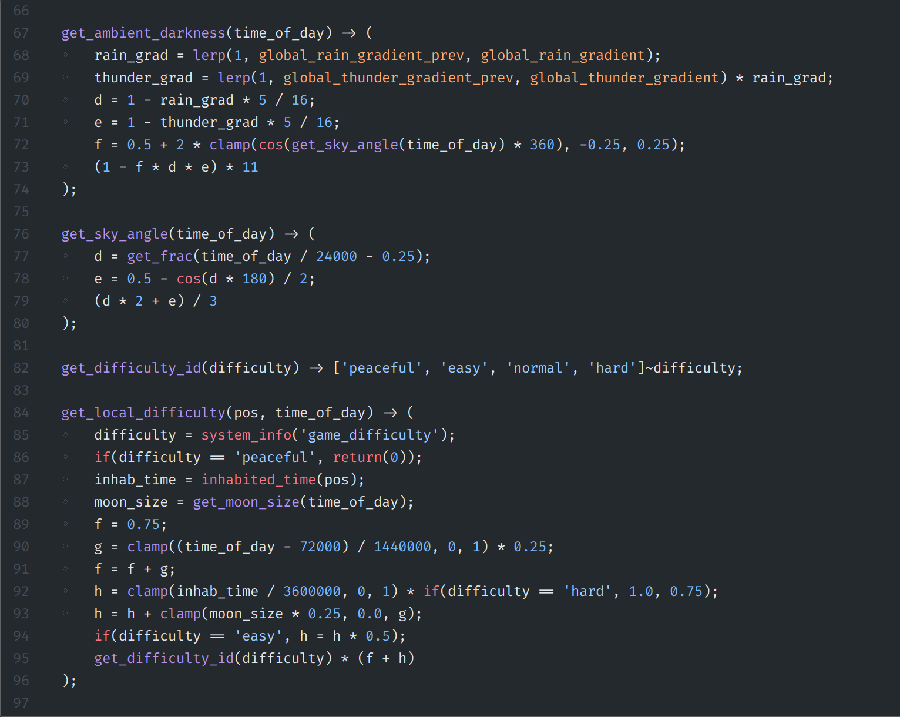
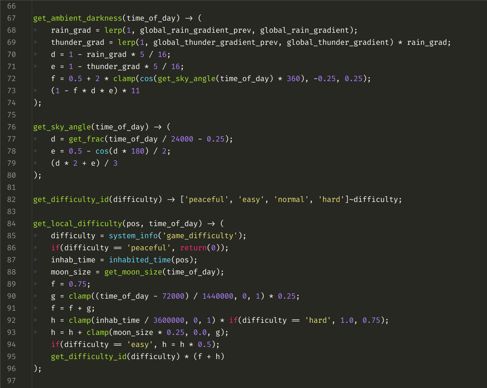

# Scarpet for Kate (KSyntaxHighlighting)

Full Syntax Highlighting support for Scarpet in [Kate](https://kate-editor.org/) through KSyntaxHighlighting.

Kate is an open source, cross platform, versatile text editor made by KDE.

Scarpet is a scripting language for Minecraft supported by Gnembon's [Carpet Mod](https://github.com/gnembon/fabric-carpet).

## Screenshots

## Installation
Download or move [`scarpet.xml`](./scarpet.xml) to one of the following folders, depending on the platform (or how Kate was installed).

You may need to create the directories if they are not present.

| Platform              | Directory                                                                               |
|-----------------------|-----------------------------------------------------------------------------------------|
| On Windows®           | `%USERPROFILE%\AppData\Local\org.kde.syntax-highlighting\syntax`                        |
| For local user        | `$HOME/.local/share/org.kde.syntax-highlighting/syntax/`                                |
| For all users         | `/usr/share/org.kde.syntax-highlighting/syntax/`                                        |
| For Flatpak packages  | `$HOME/.var/app/flatpak-package-name/data/org.kde.syntax-highlighting/syntax/`          |
| For Snap packages     | `$HOME/snap/snap-package-name/current/.local/share/org.kde.syntax-highlighting/syntax/` |
